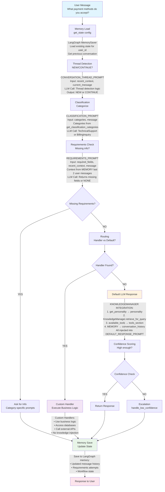
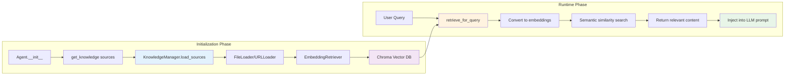
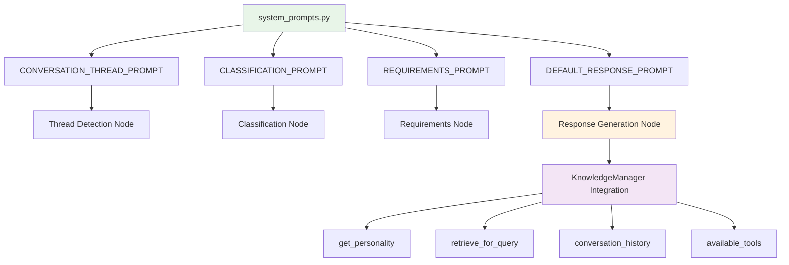

# Agentic Framework Data Flow

This diagram shows the complete data flow through the Agentic framework with enhanced knowledge integration.

## Interactive Data Flow Diagram

## Knowledge System Flow

## System Prompts Integration

## Key Features

- **Interactive Mermaid Diagrams** - Clean, scalable, and easy to read  
- **GitHub Compatible** - Renders perfectly in GitHub and most markdown viewers  
- **Maintainable** - Easy to update and modify  
- **Multiple Views** - Main flow, knowledge system, and prompts integration  
- **Color Coded** - Different components have distinct colors for clarity