# 🔄 Agentic Framework Data Flow

This diagram shows the complete data flow through the Agentic framework with enhanced knowledge integration.

## 📊 Interactive Data Flow Diagram

```mermaid
flowchart TD
    A[🔵 User Message<br/>What payment methods do you accept?] --> B
    
    B[🧠 Memory Load<br/>get_state config] --> |LangGraph MemorySaver<br/>Load existing state for user_id<br/>Get previous conversation| C
    
    C[🎛️ Thread Detection<br/>NEW/CONTINUE?] --> |CONVERSATION_THREAD_PROMPT<br/>Input: recent_context, current_message<br/>LLM Call: Thread detection logic<br/>Output: NEW or CONTINUE| D
    
    D[🎛️ Classification<br/>Categorize] --> |CLASSIFICATION_PROMPT<br/>Input: categories, message<br/>Categories from get_classification_categories<br/>LLM Call: TechnicalSupport or BillingInquiry| E
    
    E[🎛️ Requirements Check<br/>Missing info?] --> |REQUIREMENTS_PROMPT<br/>Input: required_fields, recent_context, message<br/>Context from MEMORY last 2 user messages<br/>LLM Call: Returns missing fields or NONE| F
    
    F{Missing Requirements?} --> |YES| G[❓ Ask for Info<br/>Category-specific prompts]
    F --> |NO| H[🔀 Routing<br/>Handler vs Default?]
    
    H --> I{Handler Found?}
    I --> |YES| J[⚙️ Custom Handler<br/>Execute Business Logic]
    I --> |NO| K[🎛️ Default LLM Response]
    
    J --> |📚 Custom Handlers:<br/>• Use business logic<br/>• Access databases<br/>• Call external APIs<br/>• No knowledge injection| P
    
    K --> |📚 KNOWLEDGEMANAGER INTEGRATION:<br/>1. get_personality → personality<br/>2. KnowledgeManager.retrieve_for_query<br/>3. available_tools → tools_section<br/>4. MEMORY → conversation_history<br/>All injected into DEFAULT_RESPONSE_PROMPT| L
    
    L[🎯 Confidence Scoring<br/>High enough?] --> M{Confidence Check}
    M --> |YES| N[✅ Return Response]
    M --> |NO| O[⚠️ Escalation<br/>handle_low_confidence]
    
    G --> P[🧠 Memory Save<br/>Update State]
    N --> P
    O --> P
    
    P --> |Save to LangGraph memory:<br/>• Updated message history<br/>• Requirements attempts<br/>• Workflow state| Q[📤 Response to User]
    
    style A fill:#e1f5fe
    style K fill:#fff3e0
    style J fill:#f3e5f5
    style P fill:#e8f5e8
    style Q fill:#fce4ec
```

## 🔧 Knowledge System Flow

## 🎯 System Prompts Integration

## Key Features

✅ **Interactive Mermaid Diagrams** - Clean, scalable, and easy to read  
✅ **GitHub Compatible** - Renders perfectly in GitHub and most markdown viewers  
✅ **Maintainable** - Easy to update and modify  
✅ **Multiple Views** - Main flow, knowledge system, and prompts integration  
✅ **Color Coded** - Different components have distinct colors for clarity